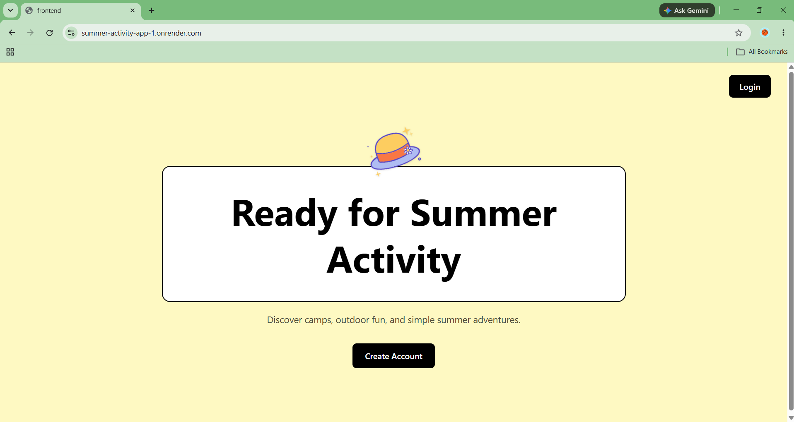
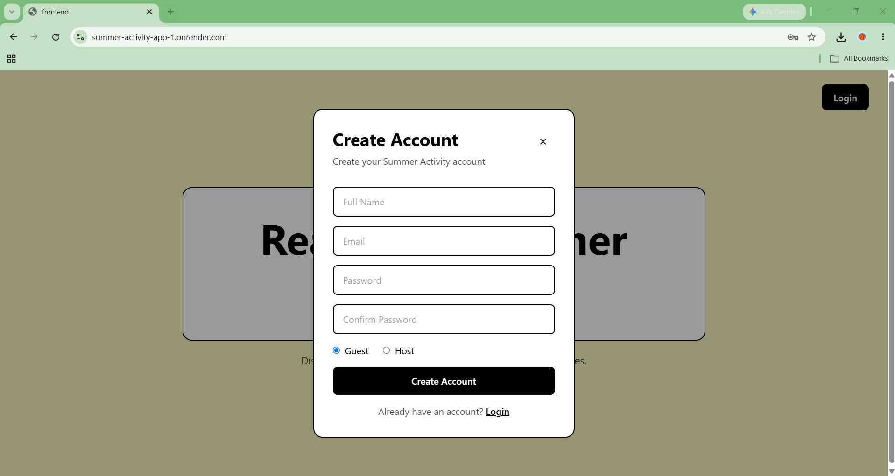
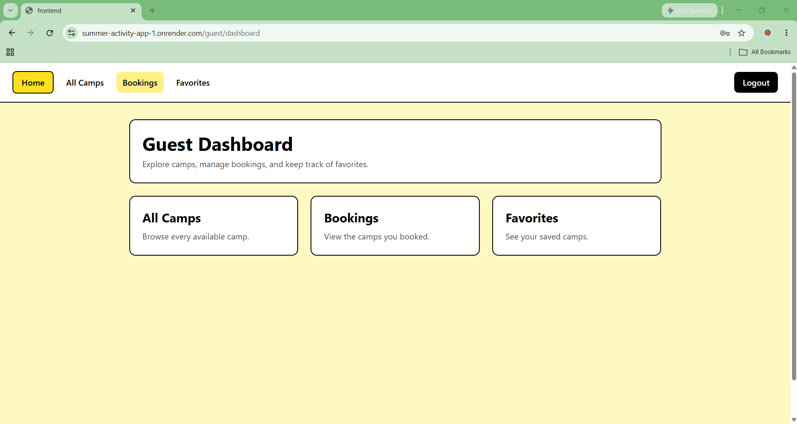
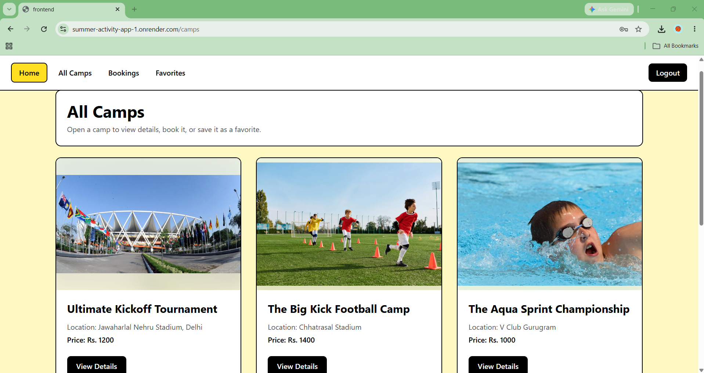
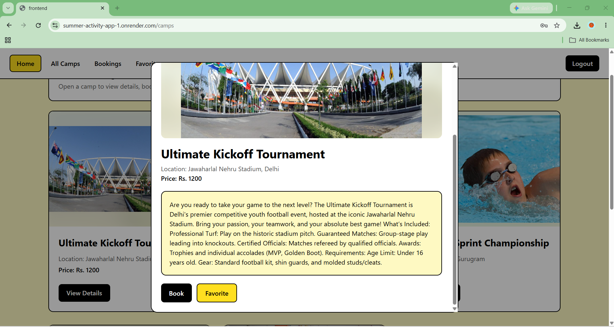

# Summer Activity Camp Booking App

A full-stack MERN camp booking application where hosts can create and manage summer activity camps, and guests can browse camps, view details, book camps, and save favorites.

The app also includes role-based profile pages and a dummy payment flow for confirming guest bookings.

## Project Motivation

Many children in India spend their summer holidays without enough structured outdoor activities, learning opportunities, or affordable events to join. This app was created to make summer activities easier to discover and book by bringing low-cost camps and events into one simple platform.

The goal is to help parents and students find useful summer programs, while also giving hosts a place to list and manage their camps.

## Live Demo

[View Live App](https://summer-activity-app-1.onrender.com/)

Note: This app is hosted on Render's free plan, so the first load may take a few seconds if the server was inactive.

## Screenshots

### Home Page


### Create Account


### Guest Dashboard


### All Camps


### Camp Details


The project is built with a clear separation of responsibilities:

- Zustand stores application data
- Custom hooks handle API calls
- React components handle the UI

## Features

### Guest

- Sign up and login as a guest
- View guest profile details
- View all available camps
- Open camp details in a modal
- Book a camp with dummy payment confirmation
- Add camps to favorites
- Remove camps from favorites
- View all bookings
- View all favorite camps

### Host

- Sign up and login as a host
- View host profile details
- Create a new camp
- Upload a JPG or PNG camp image
- Image size validation up to 1 MB
- View all camps created by the host
- Edit camp details and image
- Delete a camp
- Deleted camps are also removed from guest bookings and favorites

### General

- Role-based protected routes
- JWT authentication with cookies
- Role-based user profile page
- Dummy payment flow for booking confirmation
- Toast messages for validation and API feedback
- Zustand state management
- MongoDB Atlas database
- React loading spinner
- Responsive UI with Tailwind CSS
- Production setup for Render deployment

## Tech Stack

### Frontend

- React
- Vite
- React Router
- Zustand
- Tailwind CSS
- React Hot Toast
- React Spinners

### Backend

- Node.js
- Express.js
- MongoDB Atlas
- Mongoose
- JWT
- Cookie Parser
- CORS
- bcrypt

## Project Structure

```txt
newProjectofsummercampbookings/
|-- backend/
|   |-- controllers/
|   |-- middleware/
|   |-- models/
|   |-- mongoConnect/
|   |-- routes/
|   |-- utils/
|   `-- server.js
|-- frontend/
|   |-- public/
|   |-- src/
|   |   |-- components/
|   |   |-- context/
|   |   |-- Guest hooks/
|   |   |-- Host hooks/
|   |   |-- pages/
|   |   |-- services/
|   |   `-- zustand/
|   `-- vite.config.js
|-- screenshots/
|-- package.json
`-- README.md
```

## Environment Variables

Create a `.env` file in the project root.

```env
MONGO_DB_URI=your_mongodb_atlas_connection_string
JWT_SECRET=your_jwt_secret
PORT=5000
NODE_ENV=development
```

Do not push your `.env` file to GitHub.

## Run Locally

### 1. Install backend dependencies

```bash
npm install
```

### 2. Install frontend dependencies

```bash
npm install --prefix frontend
```

### 3. Start the backend

```bash
npm run dev
```

The backend runs on:

```txt
http://localhost:5000
```

### 4. Start the frontend

Open another terminal and run:

```bash
npm run dev --prefix frontend
```

The frontend runs on:

```txt
http://localhost:5173
```

## API Routes

### Auth

```txt
POST /api/auth/signup
POST /api/auth/login
POST /api/auth/logout
GET  /api/auth/me
```

### Guest

```txt
GET /api/guest
GET /api/guest/camps/:campId
```

### Bookings

```txt
POST /api/bookings/pay/:campId
POST /api/bookings/:campId
GET  /api/bookings
```

`POST /api/bookings/pay/:campId` is a dummy payment route. It marks the booking as paid, stores the dummy payment method, saves the amount paid, and confirms the booking.

### Favorites

```txt
POST /api/favourites/:campId
GET  /api/favourites
```

### Host

```txt
POST   /api/host/createcamp
GET    /api/host/my-camps
GET    /api/host/camp/:campId
PUT    /api/host/camp/:campId
DELETE /api/host/camp/:campId
```

## Deployment

This project is configured so the Express backend can serve the production React build.

For Render, use:

### Build Command

```bash
npm run build
```

### Start Command

```bash
npm start
```

Add these environment variables in Render:

```txt
MONGO_DB_URI
JWT_SECRET
NODE_ENV=production
```

Render automatically provides the `PORT`.

## Image Upload Notes

Camp images are stored in MongoDB as base64 strings.

The app currently accepts:

- JPG images
- PNG images
- Maximum image size: 1 MB

This keeps the project simple for learning and demonstration. For a larger production app, image storage services like Cloudinary, AWS S3, or Firebase Storage would be better.

## Future Improvements

- Add booking cancellation
- Add image cloud storage
- Add search and filter options
- Add admin dashboard
- Add better form validation messages
- Replace dummy payment with Razorpay or Stripe

## Author

Created by Tilok.
